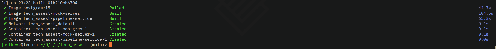
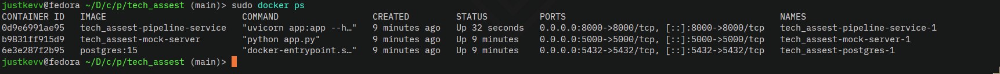
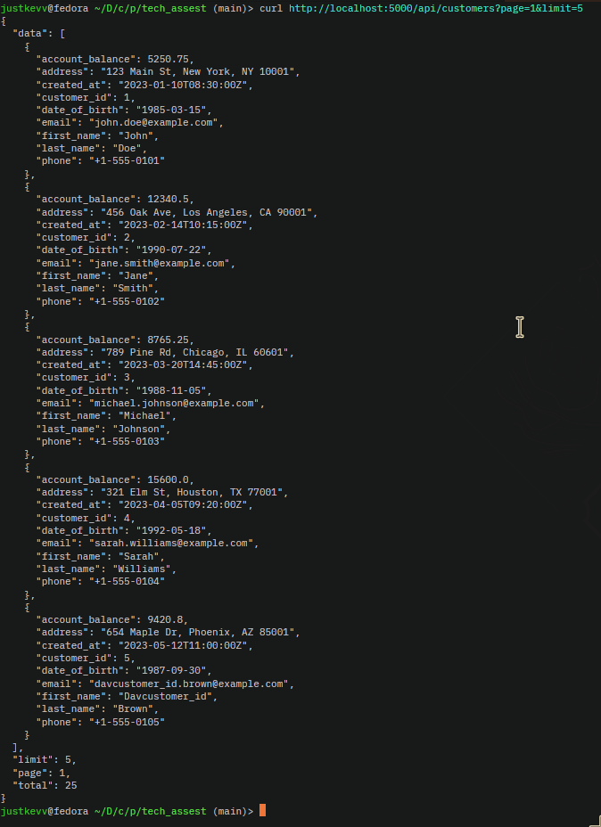
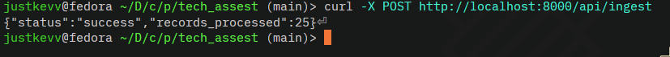
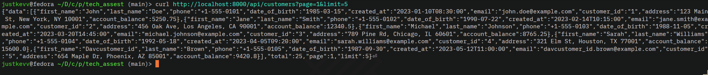

# **Testing**

## Start all services

```bash
docker-compose up -d
```


```bash
docker ps
```


# Test Flask 

```bash 
curl http://localhost:5000/api/customers?page=1&limit=5
```


# Ingest data 
```bash
curl -X POST http://localhost:8000/api/ingest 
```

# Get customers
```bash
curl http://localhost:8000/api/customers?page=1&limit=5 
```



